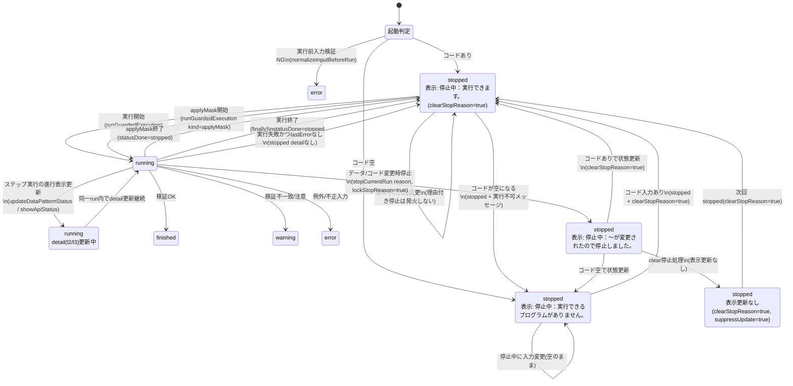

# 実行状態とステータスメッセージの状態遷移

## 補足

- `stopped` は `detail` なしなら「実行できます」、`detail` ありならその理由文言を表示します。
- `clearStopReason=true` を渡さないと、直前の停止理由が残って再表示されます。
- `normalizeInputBeforeRun()` で不正入力（例: 非ASCIIなど）が検出された場合は、`running` に入る前に `error` へ遷移します。
- `applyMask` は `runGuardedExecution` を通るため、`running -> stopped` の遷移を単独で持ちます。
- `running` 中はステップ進行に応じて `detail(l2/l3)` が更新されます（状態キーは `running` のまま）。
- `clearStopReason + suppressUpdate` は内部状態クリア用で、表示文言を更新しない遷移です。
